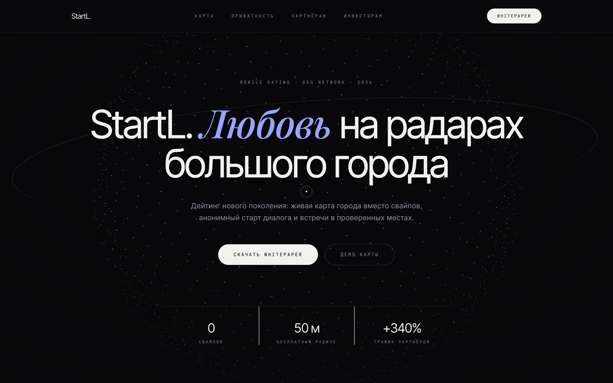
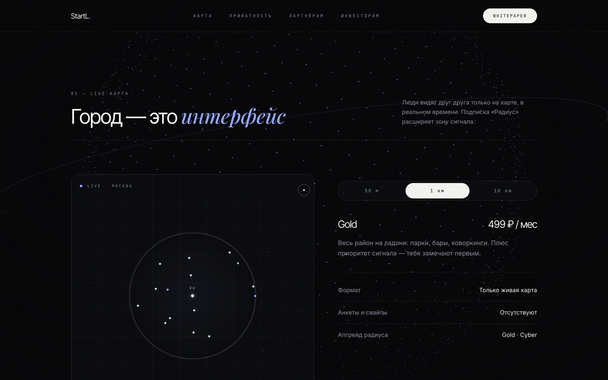
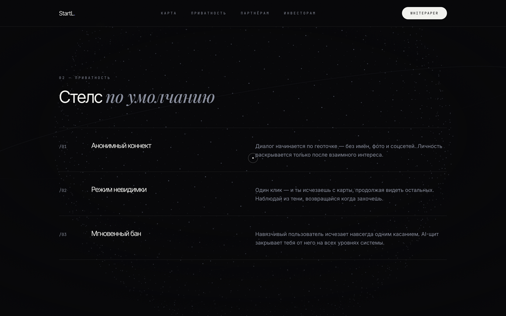
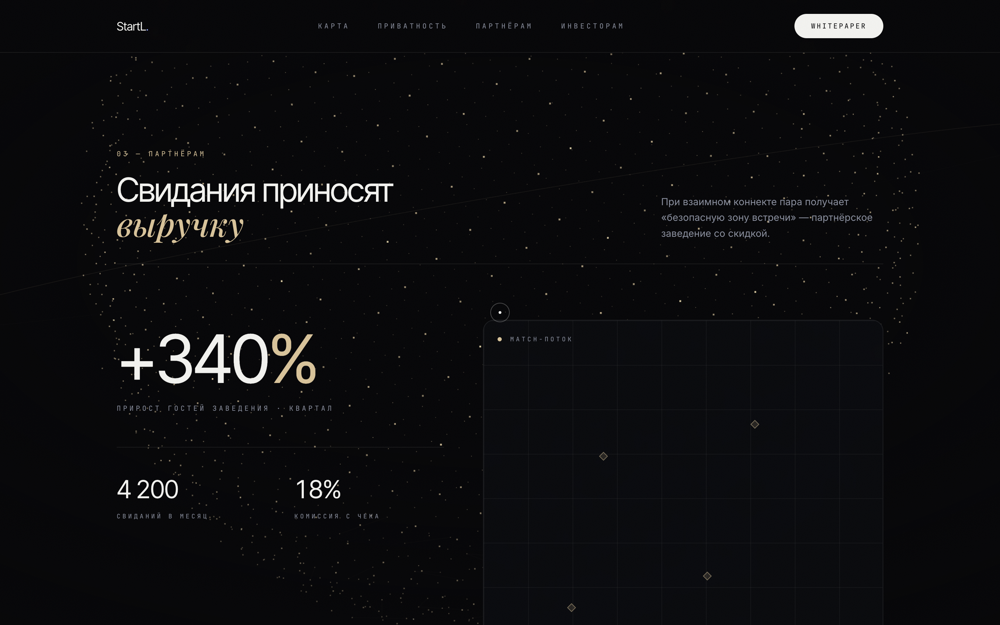
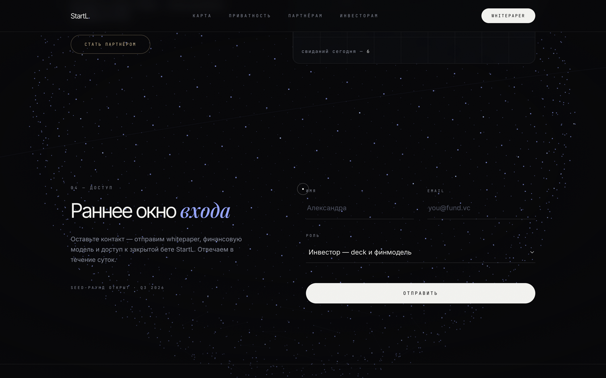

# StartL — Любовь на радарах большого города

> Single-file investor landing page for **StartL**, a geo-radar dating concept.
> Three.js particle globe · GSAP scroll choreography · Lenis smooth scroll · Tailwind.
> **One HTML file. Zero build step.**

**Live demo → [timofeyhh.github.io/startl-landing](https://timofeyhh.github.io/startl-landing/)**



## Концепция продукта

StartL — дейтинг нового поколения без свайпов: люди видят друг друга на живой карте города в реальном времени.

- **Live-карта вместо анкет** — бесплатный радиус 50 м, подписка «Радиус» расширяет зону сигнала до 1 км (Gold) или всего города (Cyber)
- **Стелс по умолчанию** — анонимный старт диалога по геоточке, режим невидимки в один клик, мгновенный бан
- **B2B-модель** — при взаимном коннекте пара получает «безопасную зону встречи» в партнёрском заведении со скидкой; заведение платит комиссию только за реально пришедших гостей

## Что внутри

| | |
|---|---|
| **3D-фон** | Сфера из 2 600 частиц (распределение Фибоначчи) на Three.js: параллакс за курсором, наезд камеры по скроллу и перекраска частиц под активную секцию — серебро → перванш → шампань-золото |
| **Типографика** | Inter Tight с плотным трекингом + курсивный Playfair Display для акцентных слов — редакционный приём «дорогого» минимализма |
| **Скролл** | Lenis (инерционный скролл) + GSAP ScrollTrigger (появление блоков, счётчики, смена оттенка сцены) |
| **Интерактив** | Демо радиуса с переключением тарифов 50 м / 1 км / 10 км, match-поток на карте партнёров, кастомный курсор-прицел над формой |
| **Устойчивость** | Graceful degradation: при недоступности CDN контент остаётся полностью читаемым |

## Скриншоты

| Live-карта (тариф Gold) | Стелс-протокол |
|---|---|
|  |  |

| Партнёрская секция | Форма для инвесторов |
|---|---|
|  |  |

## Запуск

Никакой сборки не требуется:

```bash
open index.html
```

Или просто двойной клик по файлу — всё подтянется с CDN (Tailwind, GSAP, Lenis, Three.js r158, Google Fonts).

## Стек

`HTML` · `Tailwind CSS` · `Three.js` · `GSAP + ScrollTrigger` · `Lenis` · `Vanilla JS`

---

Дизайн и код: [Timofeyhh](https://github.com/Timofeyhh) · MIT License
